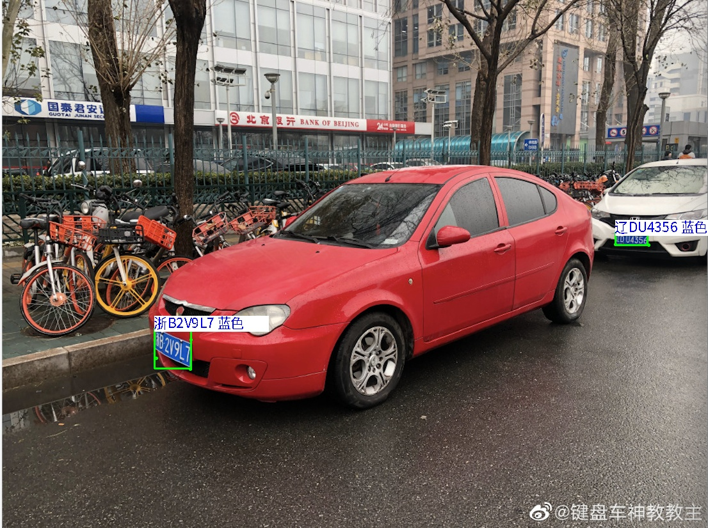

# yolov7车牌识别NCNN

pytorch项目源于[https://github.com/we0091234/yolov7_plate](https://github.com/we0091234/yolov7_plate)

1. 修改CMakeLists.txt  换成你库路径
2. build

   ```
   1. mkdir build
   2. cmake ..
   3. make

   ```
3. 推理

   ```
   ./yolov7_plate /mnt/Gu/xiaolei/cplusplus/NCNN/ncnn_plate_v7/test_img/single_blue.jpg
   ```
   结果显示在控制台
   
